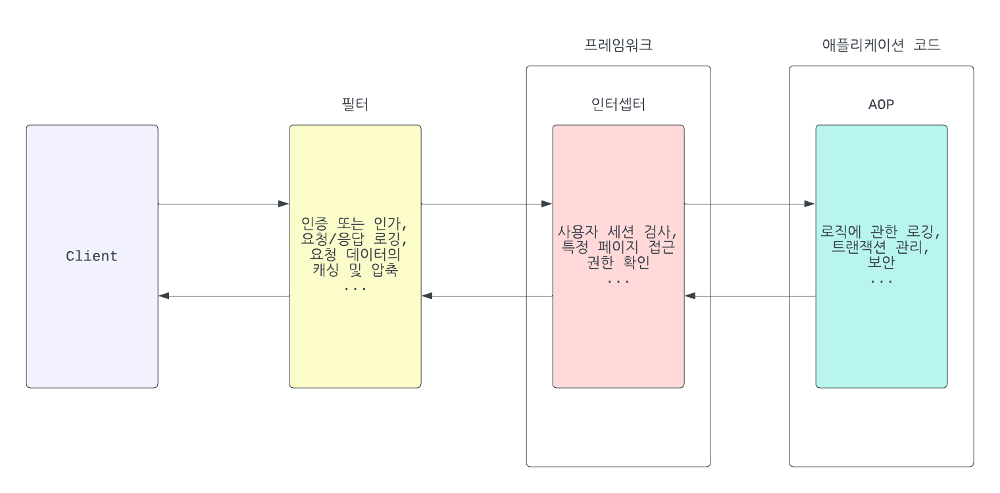

**평소 궁금하거나 면접에서 받은 질문 혹은 공부한 내용들을 간단하게 정리합니다.**

## Pyhon
1. [매직메소드 init과 new의 차이](#매직메소드-init과-new의-차이)
2. [Namespace란?](#namespace란)
3. [Iterator와 Generator](#iterator와-generator)

## DataBase
1. [트랜잭션 격리수준](#트랜잭션-격리수준)

## Nginx
1. [Nginx 사용시 server블록 설정이 겹칠 경우](#nginx-사용시-server블록-설정이-겹칠-경우)

## OS
1. [Swap 영역이란?](#swap-영역이란)
2. [PageCache란?](#pagecache란)

## JPA
1. [영속성 컨텍스트란?](#영속성-컨텍스트란)

## Web
1. [Filter, Interceptor, AOP의 개념과 차이점](#filter-interceptor-aop의-개념과-차이점)

## 객체지향
1. [상속(Inheritance)과 조합(Composition)](#상속inheritance과-조합composition)

## CS
1. [Call By Value, Call by Address란?](#call-by-value-call-by-address란)

## AI
1. [Inference GPU 최적화 방법](#inference-gpu-최적화-방법)
2. [CNN 헤쳐보기](#cnn-헤쳐보기)

## Infra
1. [MessageQueue 비교](#messagequeue-비교)
2. [Messaging Patterns](#messaging-patterns)
--- 

### 매직메소드 init과 new의 차이
  * `new` 메소드는 객체의 생성을 담당하며, 객체가 메모리에 할당될때 호출됩니다. 클래스의 인스턴스를 반환합니다. 첫번째 매개변수로 클래스(cls)를 받아야 합니다. 객체 생성을 사용자 정의하려면 new 메소드를 오버라이드 해야합니다.
  * `init` 메소드는 객체의 초기화를 담당하며, 주로 객체가 생성된 후 속성 값 등을 설장하기 위해 호출됩니다. 첫번째 매개변수로 인스턴스(self)를 받으며 반환값은 없습니다. 객체의 속성을 초기화 하려면 init 메소드를 사용합니다.
  * 대부분의 경우 객체의 초기화만 필요하기 때문에 `init`만 오버라이드 하지만, 특별한 객체 생성이 필요한 경우(ex.인스턴스 개수 제한)에는 `new`도 오버라이드 할 수 있습니다.

### Nginx 사용시 server블록 설정이 겹칠 경우
 * Server 블록이 겹칠경우 Nginx에서 우선순위
  1. **server_name 지시어 사용**: 먼저 `server_name`지시어를 사용하여 요청된 호스트 이름과 일치하는 `server`블록을 찾고 선택합니다. 만약 모든 설정에 `server_name`지시어가 명시되지 않았거나 일치하지 않을 경우, 다른요소를 고려합니다.
  2. **default_server 옵션**: `listen` 지시어에 `default_server` 옵션이 사용된 경우, 해당 `server` 블록이 기본 서버로 선택됩니다. 예를들어, `custom.conf` 파일에 `listen 80 default_server;` 옵션이 설정되어 있다면, 80포트로 들어오는 모든 요청의 기본 서버로 작동합니다.
  3. **설정 파일의 읽는 순서**: 지시어에 대한 명시적인 설정이 없는 경우, Nginx는 설정 파일을 읽는 순서에 따라 `server`블록을 선택합니다. 일반적으로 알파벳순서로 파일을 읽습니다. 예를들어 `custom.conf` 파일과 `default.conf` 파일 모두에 `listen 80`이 설정되어 있을경우 80 포트로의 모든 요청은 `custom.conf`파일의 설정이 우선으로 적용됩니다.

### Swap 영역이란?
	swap 영역은 운영체제에서 사용하는 중요한 컴포넌트중 하나입니다.
 1. **정의:** 
	*	Swap 영역은 하드 드라이브의 일부분으로, RAM이 가득 찼을경우 메모리를 확장하는데 사용됩니다. 즉, RAM의 일부분이 필요할 때 이 영역에 데이터를 임시로 저장합니다.
 2. **사용 목적:**
	* `메모리관리`: RAM이 가득 찼을 경우, 운영체제는 사용되지 않는 메모리 페이지를 swap 영역으로 이동시켜 RAM 공간을 확보합니다.
	* `메모리 오버커밋`: 물리적 RAM 크기보다 더 많은 메모리를 프로세스에 할당할 수 있습니다. 이를 통해 시스템은 더 많은 프로세스를 동시에 실행할 수 있습니다.
	* `휴면(hibernate)지원`: 휴면 상태로 전환할 때, 시스템의 현재 상태(RAM의 내용)를 swap 영역에 저장하여 전원을 완전히 끌 수 있습니다. 전원을 다시 켤 때, swap에서 RAM으로 데이터를 복원하여 이전 상태로 돌아올 수 있습니다.
 3. **장/단점:**
	*	`장점`: RAM이 부족할 때 시스템의 메모리 부족 문제를 완화시켜줍니다. 또한, 더 많은 애플리케이션을 동시에 실행할 수 있도록 합니다.
 	*	`단점`: swap영역도 하드 드라이브 이므로 RAM에 비해 상대적으로 느립니다. 따라서, swap 영역에 많은 데이터가 저장되면 시스템의 성능이 저하될 수 있습니다.

### Namespace란?
	네임스페이스(Namespace)는 이름(name)을 객체에 매핑하는 것입니다. 
	네임스페이스는 변수나 함수, 클래스 등의 이름이 그것이 참조하는 실제 객체를 어떻게 찾아가는지를 결정하는 매핑입니다.
	파이썬에서는 여러 유형의 네임스페이스가 있으며, 각 네임스페이스는 다른 생명주기를 가집니다.
 - **Namspace 유형:**

 	1. **로컬 네임스페이스(Local namespace)**: `함수 내부`에서 정의된 변수들의 네임스페이스입니다. 함수가 호출될 때 생성되고, 함수가 종료될 때 소멸됩니다.
	 2. **인클로징 네임스페이스(Enclosing namespace)**: 중첩된 함수의 `바깥쪽 함수`에 대한 네임스페이스입니다. 인클로징 네임스페이스는 내부 함수를 감싸고 있는 바깥 함수의 `로컬 변수`들을 참조할 수 있게 해줍니다.
	 3. **전역 네임스페이스(Global namespace)**: `모듈 또는 스크립트의 최상위` 수준에서 정의된 변수, 함수, 클래스 등이 여기에 포함됩니다. 모듈이 임포트될 때 생성되며, 인터프리터가 종료되거나 `del`문을 사용하여 명시적으로 삭제될때까지 유지됩니다.
 	4. **내장 네임스페이스(Built-in namespace)**: 파이썬에서 `내장된 함수와 예외`들이 여기에 포함됩니다. 파이썬 인터프리터가 시작될 때 생성되고 프로그램 종료시 소멸됩니다.

 - **Namspace 접근순서:**
   	<br/>변수나 함수 이름에 접근할 때 파이썬은 다음 순서로 네임스페이스를 검색합니다. **LEGB RULE**

 	1. **Local(L)**: 현재 함수의 로컬 네임스페이스
  	2. **Enclosing(E)**: 중첩된 함수의 네임스페이스
   	3. **Global(G)**: 모듈의 전역 네임스페이스
   	4. **Built-in(B)**: 파이썬의 내장 네임스페이스
	```python
	x = 10  # 전역 변수
	
	def outer_function():
	    x = 20  # 인클로징 변수
	    
	    def inner_function():
	        x = 30  # 로컬 변수
	        print(x)  # 30 출력 (로컬 네임스페이스의 x)
	
	    inner_function()
	    print(x) # 20 출력 (인클로징 네임스페이스의 x)
	
	outer_function()
	print(x) # 10 출력 (전역 네임스페이스의 x)

 	```

 ### 트랜잭션 격리수준
	트랜잭션 격리수준(Isolation Level)은 동시에 여러 사용자가 데이터베이스에 접근할 때,트랜잭션들이 서로에게 어떤 영향을 미칠 수 있는지 제어하는 설정.
	eg) "여러사람이 동시에 문서를 고치려고 할 때, 누가 언제 어떤 내용을 볼 수 있을까?"

 **READ UNCOMMITTED**: 
 - COMMIT되지 않은 데이터도 읽을 수 있음. 만약 다른 트랜잭션에서 롤백을 할 경우,데이터의 정합성이 깨짐(Dirty Read)

 **READ COMMITTED**: 
 - COMMIT이 된 데이터만 읽을 수 있음. MVCC 기반 DB(Postgresql, MySQL InnoDB)는 트랜잭션마다 스냅샷을 실시간으로 참조함
 - 읽을 때마다 최신 커밋된 버전을 조회(스냅샷 실시간 갱신)를 하므로 같은 쿼리라도 결과가 바뀔 수 있음(Non-Repeatable Read)
 - PostgreSQL 기본값

 **REPEATABLE READ**: 
 - 트랜잭션이 시작될 때 전체 테이블의 스냅샷을 생성
 - 다른 트랜잭션에서 데이터를 변경하거나 커밋해도 보이지 않음 -> Non-Repeatable Read는 방지가 됨
 - 하지만, MySQL InnoDB의 경우 행에 대한 레코드 락을 걸고, 조건 자체에 대한 락을 걸지 않으므로 새로 만들어지는 데이터가 조회 범위내에 있을경우 Phantom-read 발생
 - MySQL 기본값

 **SERIALIZABLE**: 
 - 가장 강력한 격리로, 모든 트랜잭션이 순차적으로 실행한 것처럼 제어
 - 동시성은 낮아지지만, 무결성은 가장 높음.
 - PostgreSQL의 경우 SSL(Serializable Snapshot Isolation)을 사용하여 "락"을 걸지 않고 트랜잭션 간의 충돌 여부를 계산하여 자동으로 롤백
 - MySQL의 경우 모든 읽기/쓰기 작업에 대해 "공유 락" 또는 "범위 락(next-key Lock)"을 사용


 ### 영속성 컨텍스트란?
 	JPA의 핵심 개념중 하나이며,
  	엔티티의 생명 주기를 관리하고 데이터베이스와의 상호 작용을 최적화 하는 로직을 담당하는 논리적인 개념입니다.
  - **생명주기 관리**: JPA에서는 엔티티의 생명주기가 명확하게 정의되어 있습니다. 영속성 컨텍스트는 엔티티의 `생명주기 상태(비영속, 영속, 준영속, 삭제)`를 관리합니다.
  - **1차 캐시**: 영속성 컨텍스트는 내부에 `1차 캐시`를 가지고 있습니다. 1차 캐시에는 조회한 엔티티들이 저장되며, 동일한 엔티티를 다시 조회하려고 할 때 `데이터베이스에 접근하지 않고` 1차 캐시에서 엔티티를 가져옵니다.
  - **동일성 보장**: 1차 캐시 덕분에 `동일한 트랜잭션`에서 데이터베이스의 동일한 엔티티를 두 번 조회하면, Java의 `참조 비교(==)`로 같은 것이라는 것을 보장할 수 있습니다.
  - **트랜잭션을 지원하는 쓰기 지연**: 영속성 컨텍스트는 트랜잭션이 커밋되는 시점까지 DB에 반영하지 않습니다. 이를 쓰기 지연이라 하며, 이를 통해 필요한 `SQL을 배치 처리`할 수 있습니다.
  - **변경 감지(Dirty Checking)**: 영속 상태의 `엔티티에 대한 모든 변경`은 영속성 컨텍스트에서 감지됩니다. 트랜잭션이 커밋되는 시점에 변경된 엔티티에 대한 `Update SQL`이 자동으로 실행됩니다.
  - **지연 로딩(Lazy Loading)과 즉시 로딩(Eager Loading)**: 영속성 컨텍스트는 엔티티의 `연관된 필드나 컬렉션`을 로딩하는 전략을 관리합니다. 이를 통해 `필요한 시점`에만 특정 데이터를 로딩할 수 있게 됩니다.
  - **캐스케이드(Cascade)**: 영속성 컨텍스트는 엔티티 간의 연관 관계에 설정된 `캐스케이드 옵션`을 처리합니다. 이를 통해 한 엔티티의 변경이 관련된 다른 엔티티에도 `전파될 수 있습니다.`

### Filter, Interceptor, AOP의 개념과 차이점
	필터(Filter),인터셉터(Interceptor) 그리고 AOP(Aspect-Oriented Programming)는 프로그래밍과 특히 웹 애플리케이션 개발에서 흔히 마주치는 개념들입니다.
	주로 애플리케이션의 핵심 로직에서 분리되어야 하는 공통된 작업(EX.로깅,보안,트랜잭션 처리 등)을 위해 사용됩니다.
**주요 개념**

1. **필터(Filter)**:
	- 주로 웹 애플리케이션에서 `요청과 응답`을 가로채는 역할을 합니다.
	- `HTTP` 요청이 서버로 들어오거나 나갈 때 특정 작업을 수행합니다.
	- EX: 인증 또는 인가, 요청/응답 로깅, 요청 데이터의 캐싱 및 압축 등.

2. **인터셉터(Interceptor)**:
	- 필터와 유사한 역할을 하지만, 주로 `프레임워크 수준`에서 제공하는 더 세밀한 메커니즘입니다.
	- 일반적으로 `액션 또는 라우트 수준`에서 작동하며, 특정 `액션이나 컨트롤러 메서드`가 실행되기 전 후로 로직을 삽입합니다.
	- EX: 사용자 세션 검사, 특정 페이지 접근 권한 확인 등.

3. **AOP(Aspect-Oriented Programming)**:
	- 관심사를 `핵심 로직에서 분리`하여 모듈화 하는 프로그래밍 패러다임입니다.
	- `Advice`라는 코드 조각을 `Pointcut`이라는 지정된 지점에 주입함으로써 작동합니다.
	- AOP는 메서드 호출 전후, 예외 발생 시점 등 다양한 지점에서 코드를 주집할 수 있습니다.
	- EX: 비즈니스 로직에 관한 로깅, 트랜잭션 관리, 보안 등.

**차이점**

1. **적용 범위**:<br/>
	필터는 주로 `웹 요청과 응답`에 관련된 작업에 사용되는 반면, 인터셉터는 `프레임워크` 수준의 작업에, AOP는 `애플리케이션 전반`의 공통된 작업에 사용됩니다.

2. **적용 지점**:<br/>
	필터는 `HTTP 요청/응답` 수준에서 작동하고, 인터셉터는 `프레임워크` 내 특정 액션 또는 라우트 수준에서 작동하며, AOP는 `애플리케이션 코드`의 특정 지점(EX:메서드 호출 전후)에서 작동합니다.

3. **복잡성**:<br/>
	필터와 인터셉터는 `비교적 간단한 작업`을 위해 설계되었으나, AOP는 더 `복잡한 공통 로직`을 애플리케이션 전반에 걸쳐 적용하기 위해 설계되었습니다.




### 상속(Inheritance)과 조합(Composition)
	객체지향 프로그래밍에서 상속(Inheritance)과 조합(Composition)은 클래스 간의 코드 재사용을 달성하는데 사용됩니다. 
 	각각의 방법은 장단점이 있으며 다양한 상황에서 사용됩니다.

**상속(Inheritance):**
 - 개념: 상속은 부모 클래스(슈퍼 클래스)로 부터 속성과 메서드를 **자식 클래스(서브 클래스)에게 물려주는** 메커니즘입니다. 자식 클래스는 부모 클래스의 모든 기능을 상속하며, 자식 클래스는 추가 기능을 정의하거나 부모 클래스의 기능을 재정의 할 수 있습니다.
 주로 ``IS-A``의 관계를 나타냅니다.

 - 장점:
   1. 코드 재사용: 기존 클래스의 **코드를 재사용**하여 새로운 클래스를 만들 수 있습니다.
   2. 계층 구조: 클래스 간의 계층 구조를 형성하여 코드를 **구조화**하고 관리할 수 있습니다.
   3. 다형성(Polymorphism): 상속을 통해 **다형성**을 구현할 수 있으며, 이는 여러 클래스에서 동일한 메서드 이름을 사용하여 **다양한 동작**을 제공할 수 있습니다.

 - 단점:
   1. 긴 계층 구조: 지나치게 긴 상속 계층 구조는 **복잡성을 증가**시킬 수 있으며 유지보수를 어렵게 만들 수 있습니다. 
   2. 강한 결합(Tight Coupling): 서브 클래스와 슈퍼 클래스 간에 **강한 결합**이 생길 수 있으며, 수정할 때 예상치 못한 부작용을 발생시킬 수 있습니다.
   3. 단일 상속: Java, Python과 같은 언어는 단일 상속만을 지원하므로 **한 클래스만 상속**할 수 있습니다.

**조합(Composition):**
 - 개념: 조합은 클래스가 **다른 클래스의 인스턴스를 포함**하는 것을 의미합니다. 한 클래스의 객체가 다른 클래스의 객체를 사용하여 필요한 기능을 구현합니다. 주로 ``Has-A``관계를 나타냅니다.

 - 장점:
   1. 유연성: 조합은 상속에 비해 유연성이 높으며 클래스 간의 **느슨한 결합(Loose Coupling)** 을 제공합니다.
   2. 코드 재사용: 조합을 통해 클래스의 재사용이 가능하며, **다양한 클래스를 조합**하여 새로운 클래스를 생성할 수 있습니다.
   3. 다중 조합: 상속과 다르게 **여러 클래스의 인스턴스**를 조합하여 다양한 동작을 구현할 수 있습니다.

 - 단점:
   1. 코드의 추가 복잡성: 조합을 사용하면 **인스턴스의 생성과 초기화**를 처리해야 하므로 코드가 더 복잡해질 수 있습니다.
   2. 오버헤드: 조합을 통해 여러 객체를 사용하면 추가적인 **메모리 및 성능 오버헤드**가 발생할 수 있습니다.
   

 객체지향 프로그래밍시 일반적으로는 **조합을 사용하는 것이** 더 유연하며, 복잡한 상속 계층 구조를 피할 수 있습니다. 
 그러나 일부 상황(**IS-A관계가 명확한 경우**, **다형성이 필요한 경우 등..**)에서는 상속이 더 적합할 수 있습니다. 
 따라서 두 가지 방법을 조합하여 최상의 설계를 구축하는것이 중요합니다.

### Call By Value, Call by Address란?
	"Call by Value"와 "Call by Address"는 프로그래밍에서 함수 호출 시 인수를 전달하는 방식을 설명하는데 사용되는 용어입니다.

**Call by Value(값에 의한 호출):**
 - 함수에 전달되는 인수는 해당 값의 **복사본**이 함수 매개변수로 전달됩니다.
 - 함수 내에서 매개변수를 수정하더라도 원본 변수에는 **영향을 주지 않습니다.**
 - 대부분의 **기본 데이터 타입**(정수,부동 소수점 수,문자열 등)이 "값에 의한 호출"방식으로 전달됩니다.
 - 예를 들어, C,C++,Java,Python(불변객체)와 같은 언어에서 "값에 의한 호출"방식이 사용됩니다.
```c++
// c++예제 
void modifyValue(int x) {
	x = x * 2;
}

int main() {
	int num = 5;
	modifyValue(num); // Call by Value로 num의 값은 여전히 5입니다.
	return 0;
}
```

**Call by Address(참조 또는 포인터에 의한 호출):**
 - 함수에 전달되는 인수는 해당 값의 **메모리 주소**(포인터 또는 참조)가 함수 매개변수로 전달됩니다.
 - 함수 내에서 매개변수를 수정하면 **원본 변수에 영향을 줍니다.**
 - 주로 **포인터, 참조 또는 레퍼런스**를 사용하여 함수에 전달됩니다.
 - 예를 들어, C,C++에서 포인터 또는 참조를 사용하는 경우 "참조 또는 포인터에 의한 호출"방식으로 동작합니다.
```c++
// c++예제 
void modifyValueByReference(int &x) {
    x = x * 2;
}

int main() {
    int num = 5;
    modifyValueByReference(num); // Call by Address로 num의 값은 10으로 수정됩니다.
    return 0;
}
```

Java에서는 주로 "Call by value"방식을 사용합니다.</br>
그러나 참조 자료형(객체)을 다룰 때, 해당 객체에 대한 레퍼런스가 값에 의한 호출되지만 객체 내부의 상태는 수정할 수 있습니다.
</br>이로써 일부 혼동이 발생할 수 있으므로 주의가 필요합니다.


### Iterator와 Generator
	Iterator와 Generator는 모두 파이썬에서 순회 가능한(iterable)객체를 다루는데 사용되지만,
	그 사용 방식과 목적은 약간 다릅니다. 

**Iterator(반복자):**
 - Iterator는 `__iter__()`와 `__next__()` 메서드를 구현하는 **객체**입니다.
 - Iterator는 **반복 가능한(iterable) 객체**를 통해 값을 하나씩 순회(iterate)하며 가져옵니다.
 - `__iter__()` 메서드는 Iterator 객체 자신(self)을 반환하고, `__next__()` 메서드는 다음 값을 반환하거나 StopIteration 예외를 발생시켜 순회를 종료합니다.
 - 주로 사용자 정의 클래스를 만들어서 반복 가능한 객체에 대한 순회를 제어하고자 할 때 Itertor를 구현합니다.
 - 데이터를 한 번에 모두 메모리에 로드하지 않고, 필요한 순간에 값을 생성하고 반환할 수 있어 **메모리에 효율적**입니다.
```python
class MyIterator:
def __init__(self, max_value):
	self.max_value = max_value
	self.current = 0

def __iter__(self):
	return self

def __next__(self):
	if self.current < self.max_value:
		result = self.current
		self.current += 1
		return result
	else:
		raise StopIteration

my_iterator = MyIterator(3)
for item in my_iterator:
print(item)
```

**Generator(제너레이터):**
 - Generator는 함수 안에서 `yield` 키워드를 사용하여 값을 반환하는 **함수**입니다.
 - Generator 함수를 호출하면 제너레이터 객체가 반환되며, `yield` 키워드를 통해 값을 생성하고 함수 **실행 상태를 보존**합니다.
 - Generator 함수는 실행 중 `yield`에서 **일시 중지**하고 호출자에게 값을 전달한 후 다음 호출 때 **이전 상태를 복원**하며 실행을 재개합니다.
 - Generator는 간단하게 이터레이션을 구현하거나, **메모리에 효율적**이므로 대용량 데이터 스트림을 생성하고 처리하는데 사용됩니다.

```python
def my_generator(max_value):
    current = 0
    while current < max_value:
        yield current
        current += 1

gen = my_generator(3)
for item in gen:
    print(item)
```


**Iterator**는 순회하고자 하는 데이터가 복잡하거나 사용자 정의 클래스로 만들어진 경우에 주로 사용됩니다.
</br>
**Generator**는 데이터 생성 및 순회가 간단하며, 데이터 양이 크거나 게으른(lazy)연산이 필요한 경우에 주로 사용됩니다.


### PageCache란?
	페이지 캐시(PageCache)는 컴퓨터 시스템에서 사용되는 중요한 메모리 관리 기능 중 하나입니다.
	주로 운영 체제의 일부로 구현되며, 디스크 I/O의 효율성을 향상시키기 위해 사용됩니다.

**개념**
 - **디스크와 메모리 사이의 캐시:** 페이지 캐시는 디스크의 데이터를 메모리에 저장하는 캐시입니다. 이는 디스크 접근 시간보다 메모리 접근 시간이 훨씬 빠르기 때문에 컴퓨터의 성능을 향상시키는데 중요한 역할을 합니다.
 - **블록 단위의 데이터 저장:** 이 캐시는 디스크에서 읽거나 쓰는 데이터를 페이지(일반적으로 수 킬로바이트 크기의 블록)단위로 저장합니다. 시스템은 이 페이지들을 메모리에 보관하여 빠른 데이터 엑세스를 가능하게 합니다.

**작동 방식**
 - **읽기 작업 최적화:** 파일이나 데이터를 읽을 때, 시스템은 먼저 페이지 캐시에서 해당 데이터를 찾습니다. 캐시에 데이터가 있으면 디스크 엑세스 없이 빠르게 데이터를 제공합니다.
 - **쓰기 지연(Write-Back):** 데이터를 쓸 때, 캐시는 즉시 디스크에 데이터를 쓰지 않고 일시적으로 메모리에 데이터를 저장합니다. 이후 적절한 시점에 배치로 디스크에 데이터를 쓰게 됩니다.
 - **캐시 관리:** 운영 체제는 사용 가능한 메모리 양과 데이터 사용 빈도를 기반으로 페이지 캐시를 관리합니다. 자주 사용되는 데이터는 메모리에 남아 있게 되며, 필요에 따라 오래되거나 자주 사용되지 않는 데이터는 제거됩니다.

**중요성**
 - **성능향상:** 페이지 캐시는 디스크 I/O 작업을 줄여 시스템의 전반적인 성능을 향상시킵니다. 특히 파일 시스템과 데이터베이스 작업에 큰 영향을 미칩니다.
 - **리소스 효율성:** 디스크 접근은 비용이 높은 작업입니다.페이지 캐시를 통해 이러한 비용을 줄이고, 시스템 리소스를 효율적으로 사용할 수 있습니다.

>페이지 캐시는 모든 현대 운영 체제에서 중요한 부분이며, 시스템 성능에 큰 영향을 미칩니다. 개발자나 시스템 관리자는 이를 이해하고 효율적으로 활용함으로써 시스템의 성능을 최적화할 수 있습니다.


### Inference GPU 최적화 방법

**Inference시 GPU를 최적화 하는 방법(냉장고에 뜨거운 코끼리 넣어서 식히는 법으로 비유)**
  - **PTQ:** 만들어진 모델을 양자화해서 메모리와 속도 이점을 얻음(상대적으로 정확도는 떨어짐). 코끼리를 다이어트 시켜서 살과 근육을 모두 빼는 작업(fp32 -> 4int)이라 생각
  - **Tensor 병렬:** 각 레이어마다 연산을 GPU별로 병렬 처리 후 합치는 작업. 연산결과를 서로 공유해야 하므로 GPU간 통신은 많지만, 연산 자체의 속도가 많이 올라감. 냉장고 여러대를 가지고 한 부위(레이어)를 식히는 작업(연산)을 진행
  - **Pipline 병렬:** 레이어 단위로 GPU마다 할당함.(eg. 1~4 layer는 GPU1, 4~8 layer는 GPU2) 파이프라인 경계마다 GPU간 통신이 필요하지만, 순차적 처리이다 보니 레이턴시가 증가할 수 있음(eg. 1~4 layer에서 오래 걸리면 GPU2는 유휴시간이 길어짐).
  냉장고 여러대를 이어 붙혀서 1번 냉장고는 머리를 식히고 끝나면 2번 냉장고는 몸통을 식히고 3번 냉장고는 꼬리를 식히는 순서대로 작업

### MessageQueue 비교

* Redis: in-memory pub/sub 사용(성능 매우 우수), Celery와 호환성 좋음, 신뢰성이 낮음(ACK X), 영속성이 부족하고 손실 위험이 있음, DLQ(Dead-letter queue) 지원 X -> 직접 구현 필요
* RabbitMq: ACK를 이용한 신뢰성 보장, 다양한 exchagne 타입 지원, 우선순위 설정 가능, 영속성 가능, Celery 공식 지원 브로커, Redis에 비해 상대적으로 느림, 신뢰성이 중요한 작업(금융 처리, 중요 이벤트)
* Kafka: 디스크기반 영속성 가능, 브로커/파티션/컨슈머 단위로 수평 확장 용이, 파티션 단위 순서 보장, batch와 parallel 처리, Celery와 직접 호환은 안됨, 로그 수집 및 실시간 스트리밍에 적합

### CNN 헤쳐보기
`CNN은 이미지를 이해하는데 주로 사용되는 인공지능 신경망(Neural Network)`

**입력층:** 
- 입력층은 이미지의 **픽셀 수 * 채널 수** 만큼의 배열
- 보통 흑백이미지는 1차원, 컬러이미지는 RGB의 3차원

**합성곱층:** 
- 입력층과 커널(또는 필터)를 가지고 합성곱 연산을 수행하는 Layer
- 특정 패턴(모서리, 윤곽선, 점 등)을 감지하는데 사용
- 작은 커널이 이미지의 픽셀들을 슬라이딩 하면서 특징 맵(Feature map)을 추출
- 역전파와 경사하강법을 통해 커널을 최적화
- 비유: 사진을 루페로 확대해서 특정 패턴을 찾아내는 과정

**풀링층:**
- Future Map의 크기를 줄이는 Layer
- 연산량을 줄여 더 빠르고, 과적합을 방지
- Max polling: 영역에서 가장 큰 값을 선택 / Average Pooling: 영역의 평균값 선택
- 비유: 큰 그림을 멀리서 바라보며 핵심만 기억하는 과정

**완전연결층**
- 앞에서 만들어진 Future Map의 특징을 통해 판단하는(확률적) Layer
- 3차원의 Future Map을 Dense Layer에 입력하기 위해 1차원으로 Flatten
- 모든 특징을 정의된 모든 클래스와 연결하기 위해 모두를 연결 -> 그래서 완전연결층
- 비유: 모든 단서들을 종합하여 '이건 어떤 클래스야'라고 결론을 내리는 탐정


### Messaging Patterns

**Message Queue**
- Producer가 큐에 메시지를 넣고, Consumer가 꺼내서 처리하는 방식
- 하나의 메시지를 '단 하나의' 소비자만 처리
- 큐에 쌓이므로 소비하지 않으면 보존
- 비동기 처리, 로드 밸런싱에 사용
- RabbitMQ, SQS, Redis List
- eg) 주문 처리 시스템: 주문 요청이 큐에 쌓이면 소비자가 순서대로 메시지를 하나씩 처리하며, 한 주문은 하나의 소비자만 처리한다.

**Pub-Sub**
- Publisher가 메시지를 보내면, Subscriber가 그 메시지를 받는 방식
- 브로드캐스트로 하나의 메시지를 '모든' 구독자가 처리
- 일반적으로는 메시지를 저장하지 않으며 구독자가 없으면 메시지 유실
- 알림 서비스, 실시간 피드 전파, IoT
- Redis pub-sub, NATS
- eg) 채팅 메시지 전송: 1번 ws에서 발행된 메시지를 2번, 3번 ws에서 구독 후 메시지를 클라이언트에게 전송

**Event Streaming**
- 시간 순서대로 발생하는 이벤트 데이터를 지속적으로 기록(log)하고, 이 데이터를 필요한 소비자가 원하는 시점에 읽는 방식
- 즉, 메시지를 실시간으로 흘리되, 저장도 하고 재처리도 가능한 pub-sub
- 시간 순서 보장, 오프셋 조절, 재처리 및 재시작 처리 보장
- 카프카의 경우 topic,partition과 consumer-group간에는 pub-sub 구조, consumber-group내 consumer끼리는 queue구조
- 대규모 로그 수집, 데이터 파이프라인 등..
- Kafka, AWS Kinesis